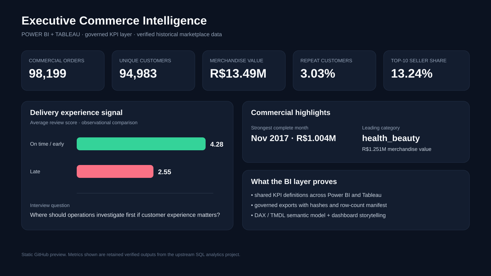

# Executive Commerce Intelligence — Power BI + Tableau

A dual-tool business-intelligence project built on a **real anonymised commercial dataset** from Olist and the same verified e-commerce warehouse used in my SQL / dbt work.

The purpose is deliberately different from a modelling project: **turn validated commercial data into decisions that an operations, commercial or product team could use.**



> The preview above is generated from the verified analysis outputs in GitHub Actions. It is not a manually typed mock-up.

## Business question

**Where is marketplace value being created, where is customer experience breaking down, and what should leadership investigate first?**

The upstream warehouse protects reporting grain before the BI layer sees the data. Orders, items, payments and reviews are reconciled before export so the dashboards do not silently inflate monetary totals through many-to-many joins.

## Verified scale

| KPI | Executed result |
| --- | ---: |
| Commercial orders | **98,199** |
| Unique customers | **94,983** |
| Merchandise value | **R$13.49M** |
| Repeat customers | **3.03%** |
| Weighted month-1 cohort retention | **0.48%** |
| Weighted month-3 cohort retention | **0.26%** |
| Weighted month-6 cohort retention | **0.23%** |
| Strongest complete month | **Nov 2017 — R$1.004M** |
| Leading state | **SP — R$5.164M** |
| Leading analysed category | **health_beauty — R$1.256M** |
| Avg review — on time | **4.28 / 5** |
| Avg review — late | **2.54 / 5** |
| Late-delivery share | **8.11%** |

These values are regenerated from the pinned source dataset rather than typed into dashboard cards.

## What the analysis actually found

The deeper analysis is retained in **[`VERIFIED_ANALYSIS.md`](VERIFIED_ANALYSIS.md)** and the machine-readable `data/analysis_*.csv` files.

### 1. Retention is the clearest commercial weakness

Only **3.03%** of customers are repeat customers, and repeat-customer segments contribute only **5.56%** of merchandise value. High-value one-time customers alone contribute **52.27%** of GMV.

The cohort view makes the problem clearer. Weighted retention among cohorts that had enough time to be observed is only:

- **0.48% at month 1** across 19 observable cohorts
- **0.26% at month 3** across 17 observable cohorts
- **0.23% at month 6** across 14 observable cohorts
- **0.18% at month 12** across 8 observable cohorts

The cohort calculation uses an **eligible cohort-age grid**: an observed month with no returning customers is retained as zero, but a future month that could not yet have occurred is excluded. This avoids both sparse-table denominator bias and artificially punishing recent cohorts with future zeroes.

That changes the dashboard question from “how many orders did we get?” to **“why are valuable first-time buyers not returning?”**

### 2. Delivery performance is tightly associated with customer satisfaction

| Delivery outcome | Orders | Avg review | 1-star reviews |
| --- | ---: | ---: | ---: |
| On time | 88,644 | **4.28** | **6.82%** |
| 1–3 days late | 1,870 | 3.28 | 25.35% |
| 4–7 days late | 1,802 | **2.09** | **59.10%** |
| 8–14 days late | 1,478 | **1.67** | **70.64%** |
| 15+ days late | 2,676 | 2.82 | 40.13% |

The overall on-time/late review gap is **1.74 points**. This is observational evidence, not a causal claim, but it is strong enough to make delivery reliability a leadership investigation area.

### 3. Operational priority should consider both value and service risk

Rather than inventing an opaque composite score, the project ranks **merchandise value currently attached to late orders**.

Examples from the verified priority table:

- **SP:** R$342k late-order GMV, 5.89% late-delivery rate
- **RJ:** R$239k late-order GMV, 13.47% late-delivery rate and 20.45% low-review orders
- **health_beauty:** R$112k late-order GMV
- **watches_gifts:** R$104k late-order GMV
- **bed_bath_table:** R$93k late-order GMV and 17.23% low-review orders

This makes the priority queue explainable to a manager and defensible in an interview.

### 4. Seller risk is concentrated enough to investigate directly

The seller review identifies **10 review-priority sellers** covering 907 seller-orders. Their average late-delivery rate is **22.56%** and average review score is **3.22**, versus 7.43% and 4.11 for the monitored seller group.

### 5. Payments are dominated by credit cards

Credit cards touch **77.0%** of commercial orders and account for **R$12.35M** of payment value, with 3.51 average instalments. Boleto is the clear second payment method at 19.89% order penetration.

Payment value is kept separate from merchandise GMV because it includes different monetary components; the dashboard does not treat the two as interchangeable.

## Two tools, distinct jobs

### Power BI — Executive Commerce Command Center

**Use case:** recurring operational and leadership review.

The source-controlled PBIP / PBIR report has **three pages**:

1. **Executive Overview** — headline KPIs, monthly GMV, category performance and delivery experience.
2. **Market & Operations** — regional value, regional delivery risk, payment behaviour and seller operational risk.
3. **Customer & Service Drivers** — customer GMV mix, right-censored cohort retention, review score by delivery-delay severity and late-order GMV priorities.

The TMDL semantic model contains **11 explicit tables**, including dedicated `CustomerSegments`, `CohortRetention`, `DeliveryImpact` and `OperationalPriority` analysis tables with reusable DAX measures.

**[Open Power BI source →](power_bi/)**

### Tableau — Marketplace Story & Explorer

**Use case:** exploratory analysis and presentation-led investigation.

The Tableau workbook contains **11 analytical worksheets across three dashboards**:

- **Executive Commerce Dashboard** — KPI pulse, monthly trend, category leaders and delivery experience.
- **Marketplace Explorer** — regional performance, payment mix and seller risk.
- **Customer & Service Drivers** — customer value structure, cohort retention, delay severity and operational priority.

The `.twb` workbook is committed as inspectable XML and contains filters, shelves and mark definitions rather than being an empty workbook shell.

**[Open Tableau source →](tableau/)**

## One governed data path

Both tools consume data generated from the same pinned, integrity-checked warehouse. The reproducibility path from repository root is:

```bash
pip install -r projects/ecommerce_sql_analytics/requirements.txt
pip install pyarrow
python projects/executive_commerce_bi/refresh_verified_data.py
python projects/executive_commerce_bi/cohort_analysis.py
python projects/executive_commerce_bi/enrich_tableau_analysis.py
python projects/executive_commerce_bi/render_dashboard_preview.py
```

That flow:

1. downloads the pinned Olist dataset version and verifies source hashes;
2. rebuilds the DuckDB warehouse with the existing SQL modules;
3. runs warehouse integrity checks;
4. compares the rebuild with retained executed headline evidence;
5. creates governed Power BI / Tableau extracts;
6. runs decision-oriented customer, delivery, category, regional, payment and seller analysis;
7. builds the eligible cohort-age grid and correctly right-censored retention curve;
8. builds a transparent operational-priority table;
9. enriches Tableau with customer, retention, service and priority analysis sections;
10. generates the GitHub dashboard preview from the verified analysis;
11. writes a manifest containing row counts, columns, hashes and verification evidence.

### Generated analysis data

- `analysis_summary.json`
- `analysis_monthly_growth.csv`
- `analysis_customer_segments.csv`
- `analysis_cohort_retention.csv`
- `analysis_retention_curve.csv`
- `analysis_delivery_impact.csv`
- `analysis_state_performance.csv`
- `analysis_category_performance.csv`
- `analysis_seller_risk.csv`
- `analysis_payment_mix.csv`
- `analysis_operational_priority.csv`

The original governed dashboard extracts remain alongside these files in [`data/`](data/).

## What a recruiter can inspect quickly

| Evidence | What it demonstrates |
| --- | --- |
| [`dashboard_preview.svg`](dashboard_preview.svg) | data-driven dashboard hierarchy generated from verified analysis |
| [`VERIFIED_ANALYSIS.md`](VERIFIED_ANALYSIS.md) | executed business findings and management interpretation |
| [`business_analysis.py`](business_analysis.py) | decision-oriented SQL/Python analysis over the verified warehouse |
| [`cohort_analysis.py`](cohort_analysis.py) | right-censored cohort retention with observed zero-return months retained correctly |
| [`render_dashboard_preview.py`](render_dashboard_preview.py) | reproducible visual communication from analysis outputs |
| [`power_bi/`](power_bi/) | PBIP, three PBIR report pages, 11-table TMDL semantic model and DAX measures |
| [`tableau/ExecutiveCommerce.twb`](tableau/ExecutiveCommerce.twb) | Tableau workbook XML with 11 worksheets and 3 dashboard layouts |
| [`KPI_DICTIONARY.md`](KPI_DICTIONARY.md) | KPI definitions, grain and caveats |
| [`refresh_verified_data.py`](refresh_verified_data.py) | real-data lineage from pinned source to analysis and dashboard extracts |
| [`tests/`](tests/) + GitHub Actions | automated BI source, data and evidence contracts |

## Analytical decisions I would discuss in an interview

- I use **merchandise value / GMV**, not “profit”, because cost and margin data are not available.
- I keep reporting grain controlled upstream instead of trying to repair duplicated revenue inside a dashboard.
- The **3.03% repeat-customer rate** is supported by an even weaker correctly censored cohort-retention curve, making retention a genuine investigation priority.
- In cohort analysis, observed zero-return months belong in the denominator; unobservable future months do not.
- Late deliveries are associated with materially weaker review scores (**2.54 vs 4.28**), but I do not describe that observational relationship as causal proof.
- The operational-priority queue ranks **late-order GMV** rather than using a black-box score.
- Seller and regional views are designed as **investigation queues**, not automated business decisions.

## Verification boundary

The **real-data refresh, retained KPI evidence, cohort methodology, deep business analysis, generated dashboard preview, Power BI/Tableau source contracts and project structure are CI-checked**. The repository does **not** claim that Power BI Desktop or Tableau Desktop/Public is running inside GitHub Actions.

A final interactive open/refresh/publication in the desktop applications is therefore a separate publication checkpoint. That boundary is stated explicitly rather than using screenshots to imply runtime verification that has not occurred.

## Skills demonstrated

**Power BI · Tableau · DAX · TMDL · PBIP/PBIR · dashboard design · KPI definition · commercial analytics · customer analytics · cohort retention · operational analytics · data visualisation · SQL lineage · DuckDB · Python · data quality · reproducible reporting · GitHub Actions**
